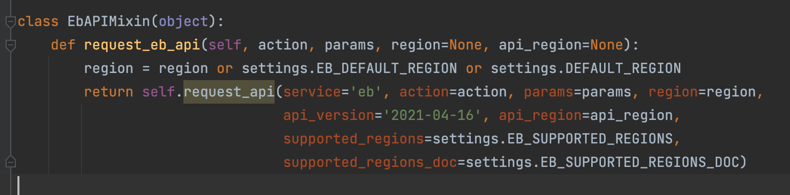
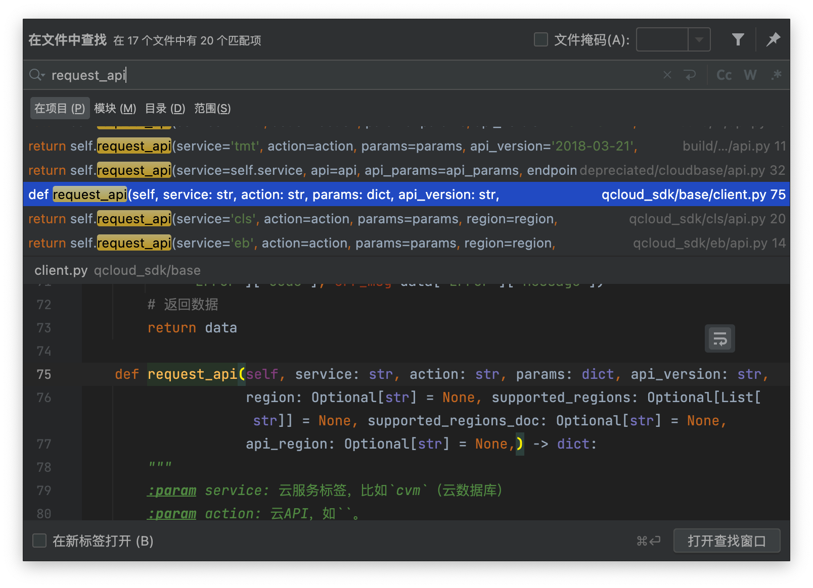

# 开发SDK

本文介绍量潮科技主导的SDK的代码风格。

## APIClient类

使用APIClient类实现和云产品基于网络协议的通信。

APIClient类广泛地见于各个SDK库。通常情况下基于语言和框架提供的HTTP库的Client类（比如Python的requests库提供的Session类或者request函数，Dart语言提供的http库的Client类）封装。可以在实现API的同时，让代码模型保持尽可能简单。

代码示例如下：

```python
client = APIClient(secret_id='secret-id', secret_key='secret_key')
client.example_api(param_for_it='param-for-it')
```

为了方便多个SDK在同一个项目使用，通常APIClient类的命名带上产品名称。如果不带，则在import时写as语句。代码示例如下：

```python
# style 1
from coding_devops_sdk import CodingOpenAPIClient
from qcloud_sdk import QCloudAPIClient

# style 2
from coding_devops_sdk import APIClient as CodingOpenAPIClient
from qcloud_sdk import APIClient as QCloudAPIClient
```

考虑在代码内部的可读性，用户在不使用后者的写法可以一眼可以看到是哪个APIClient，通常我们使用前者的代码风格。通过IDE提供的自动提醒，前者通常更容易输入，长一些可以通过自动补全，因此不太影响开发效率。

另外一种常见但不太简洁的做法是把云端服务建模到SDK内作为Provider，然后通过Client和Provider的通信实现同样的逻辑。基于此思路实现的SDK有阿里云的对象存储、北极星的Go语言SDK等。相比于上述过程式风格的API，这种建模思路更加面向对象。实际上并没有带来太多建模上的收益，往往还会更加复杂。由于Java等语言的固有限制，这样的建模是强制的；而对于Python等支持多种范式的语言，可以过程式就没有必要建过于复杂的对象模型，符合"奥卡姆剃刀"原则。

## API分层

通过合理的分层来实现稳定底层代码、灵活更变上层代码，从而提高可维护性。

1. low-level API：实现云产品的通信协议，通常包括鉴权算法、请求和返回值解析和验证等。
2. high-level API：对应API文档准确封装，通常保持稳定。
3. integrated API：根据用户需求封装high-level API，通常快速迭代。

代码示例如下：

```python
class APIClient:
    def request_api(self):
       """
       low-level API
       """
       pass
       
    def example_api(self):
        """
        high-level API
        """
        self.request_api(self)
    
    def integrated_example_api(self):
        """
        integrated API
        """
        self.example_api(self)
```

## 模块化和Mixin模式

云产品提供的API，少则数十（比如北极星SDK），多则数百甚至数千（比如腾讯云SDK）。如果集中实现在一个模块的一个APIClient类，则很不方便版本管理，多分支下很难同时不冲突PR。因此，为了提高可维护性，依照官方API文档的划分来划分SDK的模块是很有必要的。建议使用Mixin类实现具体API（在Python等语言是一种代码风格，在Dart等则有原生mixin支持），通过多重继承实现用户使用的APIClient。使用Mixin风格而不是普通的多重继承，主要是为了避免处理潜在的命名冲突，即"菱形问题"。代码示例如下：

```python
# base.py
class BaseAPIClient:
    def __init__(self, secret_id, secret_key):
        self.secret_id = secret_id
        self.secret_key = secret_key
    
    def request_api(self):
        pass
        
# mixins.py
class APIMixin:
    def example_api(self):
        return self.request_api(self)

# client.py
class APIClient(BaseAPIClient, APIMixin):
    pass
```

具体模块划分遵循同一功能维护到同一模块的原则，以方便组织不同开发者维护同一类API。此实践对于不熟悉库的开发者比较不友好，建议通过开发者文档解释具体的划分方式。比如Coding的OpenAPI文档划分为项目、仓库、CI等部分，每个部分对应一个模块。每个模块内部，通常把high-level API和integrated API的Mixin类分成两个，以方便二次开发时丢弃自定义逻辑较多的integrated API部分。此外，integrated API跨多个模块使用high-level API的情况也十分普遍，尽可能让代码正交有利于维护者理解。

代码示例：

```python
# project.py
class ProjectAPIMixin:
    pass
   
class IntegratedProjectAPIMixin:
    pass

# depot.py
class DepotAPI:
    pass
    
class IntegratedDepotAPIMixin:
    pass
```

单元测试模块可以对应此模块划分。如果某个API的分支较多，建议独立其测试类以方便多人协同维护测试用例。测试时依然调用用户APIClient类，基于前文给的代码示例调用即可。代码示例：

```python
# tests/client.py
client = APIClient()

# tests/test_example.py
class ExampleTestCase(uniitest.TestCase):
    def test_example_api(self):
        result = client.example_api()
        self.assertTrue(result)
        # other assertions
```

由于Python等动态语言在静态检查的固有缺陷，缺少原生mixin支持的Python，无法识别到mixin类使用的其他mixin或者上层API，从而对新加入的开发者理解实现造成比较大的困扰。此时建议使用全局搜索代替自动提醒，或者遵循命名和理解代码设计风格之后手动寻找。

以上述为例。比如有个API叫做`list_projects`，通常会在`project`模块。如果找不到，则通过全局搜索找到此API的实现位置。macOS快捷键为“Command+Shift+F”，Windows快捷键为“Ctrl+Shift+F”。

以腾讯云SDK的`request_api`为例。



通过快捷键打开全局搜索，在结果中找到`def request_api`即为原始定义位置。



## 保持一致

尽可能符合开发者的使用习惯，同时兼顾开发团队的维护，提出下述原则：

1. 符合语言和框架使用习惯，保持和主流规范一致的代码风格。
2. 和同产品其他语言和框架保持一致的功能。

以Python为例。Python代码通常使用蛇形命名而不是驼峰式，因此建议暴露给用户的API使用蛇形，在封装时处理成符合API入参的格式。代码示例如下：

```python
class APIClient:
    def request_api(self, api_params):
        # param_for_it -> paramForIt 
        api_params = {to_camel_case(key): value for key, value in api.params.items()}
      
    def example_api(self, param_for_it):
        # kwargs = {'param_for_it': param_for_it}
        returun self.request_api(api_params=kwargs)
```

同时，在同产品不同语言和框架的SDK中，通常都有和`example_api`相同功能的API，从而确保各个语言SDK提供相同的功能。

语言和框架本身的习惯应当优于同产品SDK。考虑到语言和框架SDK的用户通常是在同语言内使用不同产品的SDK，保持一致有利于用户。后者是开发团队的考虑，强行保持一致虽然有利于开发团队维护，却经常会造成用户使用不顺，比如腾讯云官方的Python SDK的代码风格接近Java语言，对于Python语言来说就很不友好。代码示例如下：

```python
# bad
client = UglyAPIClient()
client.secretId = 'secret-id'

# good
client = BeautifulAPIClient(secret_id='secret=id')
```

遵循Python语言的习惯，可以让Python SDK提供的API更简洁易用。

## 参考资料

- [多重继承和Mixin](https://blog.hszofficial.site/TutorialForPython/语法篇/面向对象惯用法/多重继承和Mixin.html#:~:text=Mixin是一种非常谨慎的多重继承用法%2C它的特点是%3A%201%20Mixin%20类是单一职责的%202,Mixin%20类对宿主类一无所知%203%20不存在超类方法调用%28super%29以避免引入%20MRO%20查找顺序问题)
